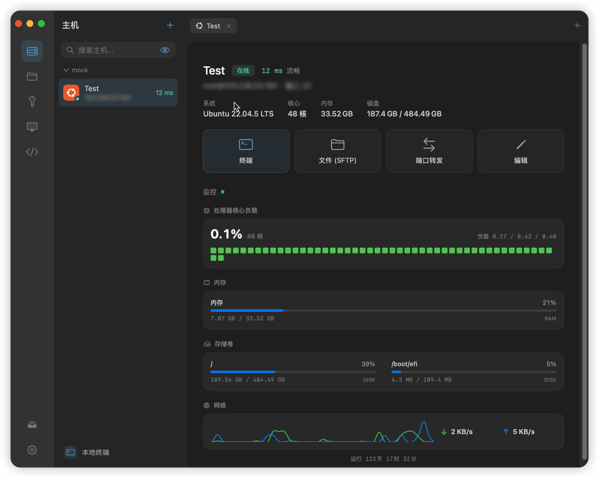

<div align="center">

<picture>
  <source media="(prefers-color-scheme: dark)" srcset="assets/logo-dark.svg">
  
</picture>

**An all-in-one native macOS remote workbench**

SSH · SFTP · Terminal · Windows Remote Desktop · Port forwarding · Host monitoring

[](https://termoi.app)
[](https://github.com/icloudza/termo/releases)
[](https://github.com/icloudza/termo/releases)
[](https://github.com/icloudza/termo/stargazers)

[](LICENSE.md)

[简体中文](README.zh-CN.md) · **English**

<br>



</div>

---

## Overview

**Termo** is a native macOS remote-operations client built with SwiftUI + AppKit. It brings the tasks you usually juggle across separate tools — SSH terminals, file transfer, Windows Remote Desktop, port forwarding, host monitoring, and key management — into a single, polished interface.

Under the hood, Termo runs its SSH / SFTP / terminal / port forwarding / keys entirely **in-process** (libssh2 + OpenSSL) — no reliance on the system `ssh`, no spawning of external processes; Windows Remote Desktop embeds **FreeRDP**. The result is a self-contained, Apple-signed and notarized single binary: steadier connections, faster startup, and nothing to set up.

## Features

| Capability | Details |
|---|---|
| **SSH terminal** | Full terminal powered by SwiftTerm; in-process libssh2 engine for stable, fast connections |
| **SFTP browsing** | Upload / download / rename / chmod, resumable transfers, concurrent queue, in-app remote code editing |
| **Windows Remote Desktop** | Embedded FreeRDP: full-color graphics pipeline, keyboard input, two-way clipboard sync, resolution that follows the window |
| **Port forwarding** | Local (-L) / remote (-R) / dynamic SOCKS (-D), running in the background with a menu-bar dashboard |
| **Host monitoring** | Live CPU / memory / disk / network charts, with system notifications on sustained load |
| **SSH key management** | Generate / import ed25519 · RSA in-process — no `ssh-keygen` dependency |
| **Snippets** | Insert or run frequently used commands in one click |
| **Unified custom UI** | Dark / light themes, a menu-bar breathing indicator, detail polished toward Ghostty / Xcode |
| **In-app auto-update** | Sparkle with EdDSA signatures, delivered via Cloudflare R2 |
| **Bilingual** | Switch the interface language in Settings |

## Download & install

> Requirements: macOS 14 (Sonoma) or later · Apple Silicon (M-series)

[](https://termoi.app)

- Recommended: get it from the [official website](https://termoi.app) via the button above
- Or grab past versions from [GitHub Releases](https://github.com/icloudza/termo/releases)

Termo is **signed with a Developer ID and notarized by Apple**, so Gatekeeper recognizes it as coming from an identified developer. Once installed, new versions are offered automatically — no need to re-download manually.

## Quick start

1. In the left activity bar, open **Hosts** and click `+` to add an SSH host (address, account, password or key)
2. Click a host to open its overview; choose **Terminal** to start a session, or **Files** to browse the remote tree
3. For Windows machines, switch to the **RDP** panel to add one, then hit **Remote Desktop**
4. Need tunneling? Configure -L / -R / -D rules under **Port forwarding** — they keep running in the background

Passwords and key passphrases are stored in the system **Keychain**, never in plaintext on disk.

## Build from source

The project is managed declaratively with [XcodeGen](https://github.com/yonaskolb/XcodeGen); native third-party dependencies (FreeRDP / libssh2 / Sparkle) ship in the repo as xcframeworks.

```bash
brew install xcodegen
git clone https://github.com/icloudza/termo.git && cd termo
xcodegen generate            # generates Termo.xcodeproj from project.yml
open Termo.xcodeproj         # open in Xcode, or build from the CLI:
xcodebuild -scheme Termo -configuration Release build
```

> Requires Xcode 16+ on an Apple Silicon machine. Re-run `xcodegen generate` after adding or removing source files.

## Architecture

- **UI**: SwiftUI + AppKit, fully custom unified components; single window with a persistent menu-bar item
- **SSH stack**: in-process libssh2 (static) + shared OpenSSL — terminal PTY / SFTP subsystem / direct-TCP forwarding / known-hosts verification / key generation
- **RDP stack**: embedded FreeRDP static library + an Objective-C bridge; BGRA frames marshalled to the main thread and drawn as CGImage
- **Persistence**: hosts / sessions as JSON + passwords merged into the Keychain (optimistic locking against multi-device races)
- **Distribution**: Developer ID signing + notarization; a git tag triggers GitHub Actions → Sparkle appcast → R2/CDN

## License

Termo is licensed under the [PolyForm Noncommercial License 1.0.0](LICENSE.md).

- **Allowed**: personal use, study and research, hobby projects, use by nonprofits — you may read, modify, and redistribute the source
- **Not allowed**: any commercial use

© 2026 cloudza

## Friends

> [LINUX DO](https://linux.do/) — a new ideal community, where tech enthusiasts gather.

---

<div align="center">
<sub>Built with Swift · <a href="https://github.com/icloudza/termo/issues">Report an issue</a></sub>
</div>
